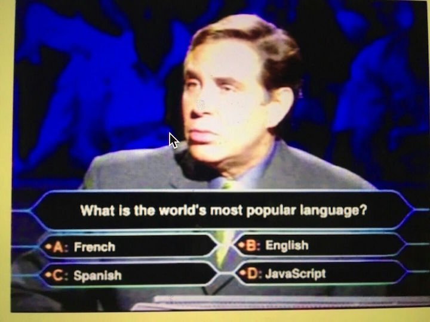

移动应用是如何运行的
===

如何识别不同的编程语言
===

漫谈编程语言：数量
---

这又是一个有趣的话题~~，要知道编程语言有那么的多。引自Quora上一个相关问题（《[How many programming languages are there in the world?](https://www.quora.com/How-many-programming-languages-are-there-in-the-world)》）的答案，从ABC到Z Shell就有256个。

但是这并不是最佳的答案，要知道维基百科上的《[List of programming languages](https://en.wikipedia.org/wiki/List_of_programming_languages)》就有500+种编程语言了。

而据另外一个历史悠久的网站“[99 Bottles of Beer](http://www.99-bottles-of-beer.net/)”(创办于1994-1998年期间，当时大概就收录了227语语言了)所统计，已经有1500+种语言了。

根据德国语言学家在1979年的统计，当时世界上已经查明的语言有5651种。要知道世界人口有75亿左右，而程序员才有18.5M（引自Quora: 《[Approximately how many programmers are there in the world?](https://www.quora.com/Approximately-how-many-programmers-are-there-in-the-world)》）。

这就意味着平均每10000个人中就会创建一个新的语言。等等，这些语言里面还没有算上很多程序员在大学学龙书（《编译原理》）时创造的各种奇怪的语言。还有，我打算在未来写的一门叫xo的语言。

然而和这一个世界类似的，不是很有人都会使用使用的语言。汉语是这个世界上使用人数最多的语言，英语是这个世界上最流行的语言。同样的，Java是这个世界上使用人数最多的语言(依据[Tiobe](http://www.tiobe.com/tiobe_index)统计的结果)，JavaScript是这个世界上最流行的编程语言。

等等，Java和JavaScript是什么关系？他们两的关系就是汉语和英语的关系，都带了一个“语”(Java)字。

漫谈编程语言：语系
---

虽然说编程语言有那么多，但是实际上平时人们在社交网络上讨论的应该就那么几十种吧。同样的这些编程语言也有语系这种概念，以母语使用人口排列（引自维基百科: 《[语言系属分类](https://zh.wikipedia.org/wiki/%E8%AF%AD%E8%A8%80%E7%B3%BB%E5%B1%9E%E5%88%86%E7%B1%BB)》），最流行的就是印欧语系、然后就是汉藏语系，当然还有其他的小类型咯。同样的，这也适用于编程语言，只是维基百科将编程语言的类型分为了四十几种（《[List of programming languages by type](https://en.wikipedia.org/wiki/List_of_programming_languages_by_type)》）——这有点超乎我的想象了。换句话来说，这TM太扯了。

要知道小时候我学编程的时候，可只有：``机器语言``、``汇编语言``、``高级语言``、``系统语言``这几种概念。但是这种分类一点都无助于我们来对编程语言进行分类。

网站是如何构建的
===

生活中的程序
===

软件是如何开发出来的
===
